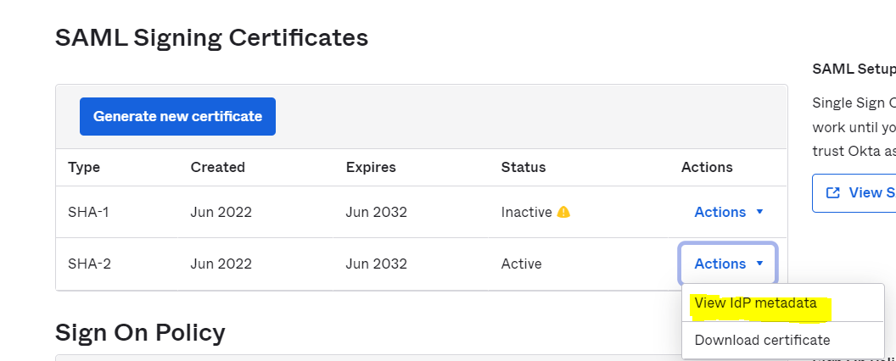

# camunda-okta-saml-sso
okta implementation using saml2 in camunda 7

Prerequisites 
Java 17
Git SCM

### Generate self-signed ssl certificate.

* Clone this repo and go to camunda-okta-saml-sso/src/main/resources/credentials
* Launch git bash in credentials directory and run this command 

`openssl req -x509 -nodes -sha256 -days 3650 -newkey rsa:2048 -keyout private.key -out certificate.crt`

It will prompt you some questions answer as per your organization.
Sample Values :

Country Name (2 letter code) [AU]:IN

State or Province Name (full name) [Some-State]:UP

Locality Name (eg, city) []:Amroha

Organization Name (eg, company) [Internet Widgits Pty Ltd]:amardeep

Organizational Unit Name (eg, section) []:tech

Common Name (e.g. server FQDN or YOUR name) []:camunda

Email Address []:abcdefgh12345@yourdmain.com

This will generate certificate.crt and private.key in credentials folder.

### Setup your application on Okta

Register for an okta developer account on https://developer.okta.com

Register an app on Okta as per details below

Navigation is : Applications : Create App Integration

*    App name                       = okta-saml-camunda-app
*    Single sign on URL             = http://localhost:8080/login/saml2/sso/camunda
*    Audience URI (SP Entity ID)    = http://localhost:8080/saml2/service-provider-metadata/camunda
*    Default RelayState             = http://localhost:8080/camunda
*    Name ID format                 = Unspecified
*    Application username           = Email Prefix
*    Assertion Encryption           = Encrypted
*    Encryption Certificate         = upload certificate.crt
*    Signature Certificate          = upload certificate.crt

   Attribute Statements :

        first, Value = user.firstName
        last , Value = user.lastName
        email , Value = user.email

   Group Attribute Statements :

        groups, Filter = Matches Regexp = .*

To extract IDP Metadata, do the following
- Go to your app in okta and click on tab "Sign On" and navigate to SAML Signing Certificates

- click on link "Identity Provider metadata"
- Right click and select "View page source"
- Copy the complete XML and paste into file "main/resources/okta-metadata.yml"

Navigation is :  Directory : People/Groups

Login to your okta Tenant and create a group called "camunda-admin"

Create few users as well and assign them to "camunda-admin" also assign this group to registered app.

Run you project using command `mvn spring-boot:run`

http://localhost:8080 will take you to Okta now.

Raise a github issue in case you see some issue.